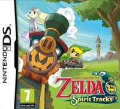
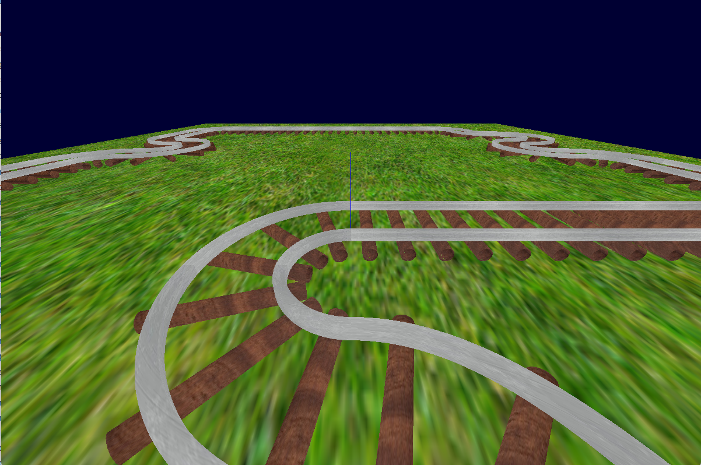
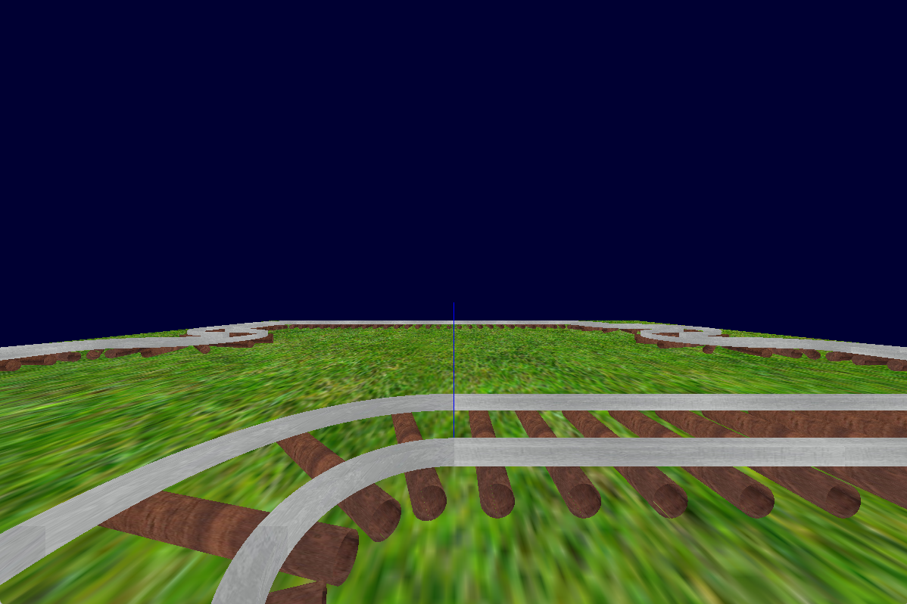
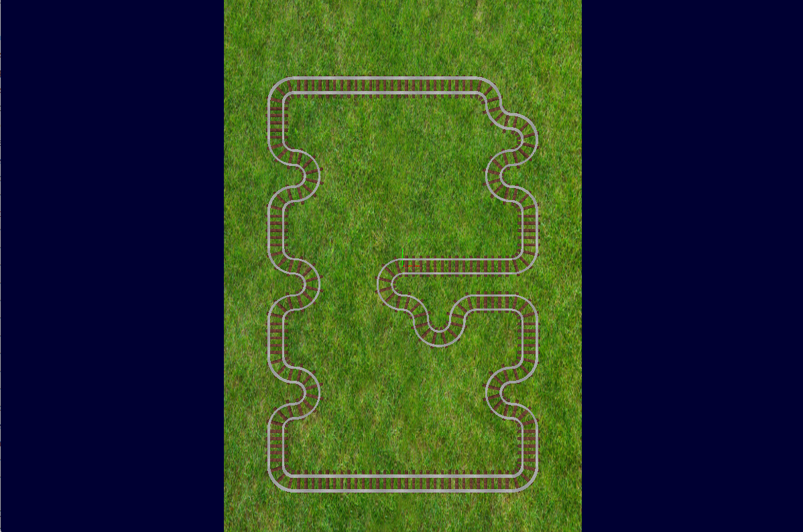
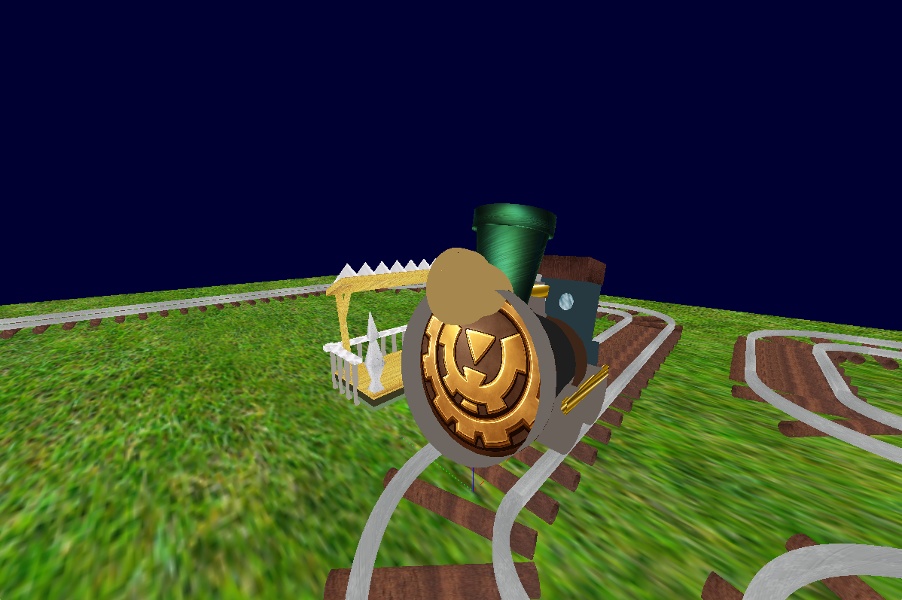
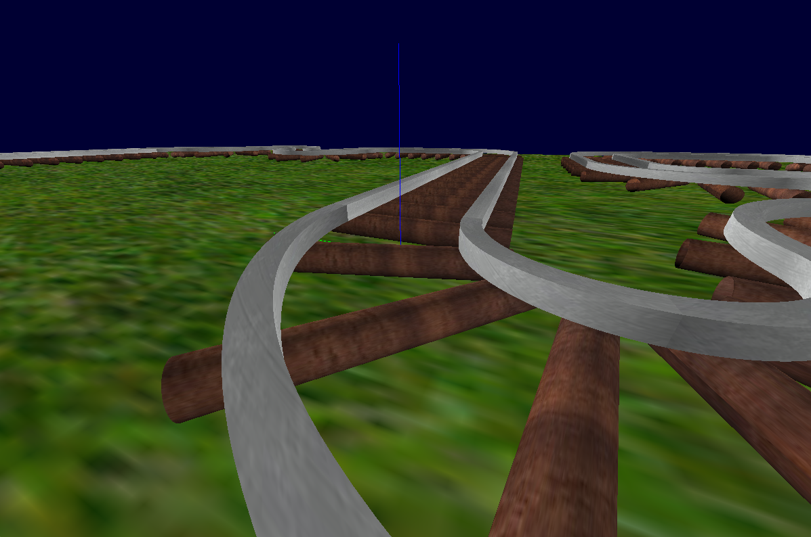
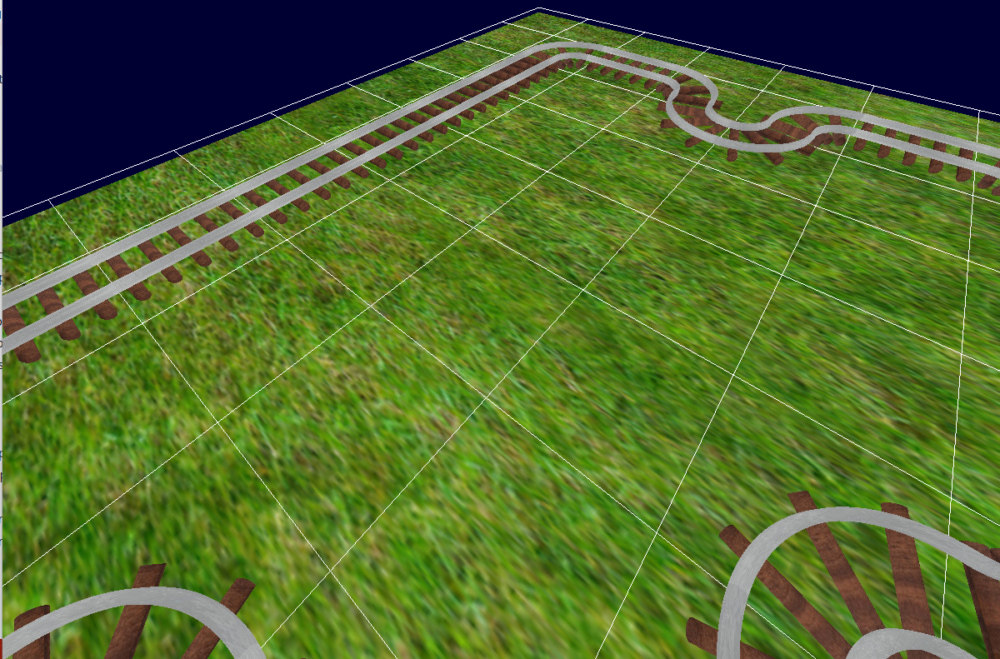
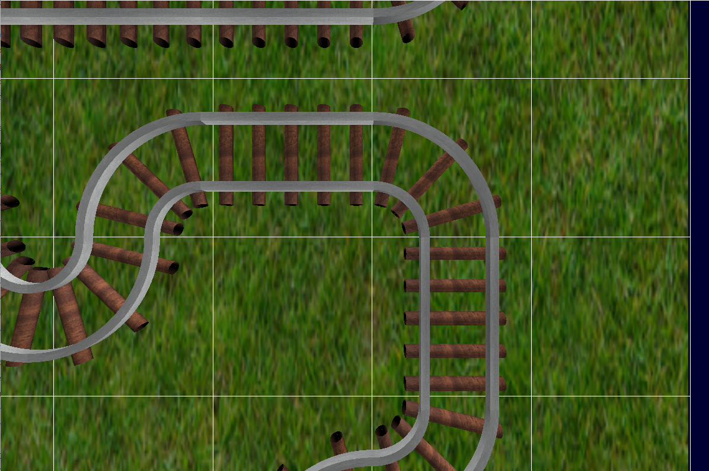

# **The Spirit Train**

Reproduction de la locomotive des dieux du jeu **_The Legend of Zelda: Spirit Tracks_**.



## **Lancer le code**

Pour lancer le code il faut aller dans le dossier **bin** :

```
cd bin
```

Pour lancer le **.exe**, il faut faire la commande suivante :

```
./TD_Train_main json.json
```

## **Commandes utilisateurs**

### **[ECHAP]** Quitter la fenêtre

L'appuie de cette touche fermera la fenêtre

---

### **[L]** Mode lumière

L'appuie de cette touche activera ou désactivera la lumière réaliste de la scène.

---

### **[G]** Afficher / Retirer la grille du terrain

L'appuie de cette touche activera ou désactivera l'affichage de la grille du terrain.

---

### **[C]** Changer de Caméra _(Orbital, FPS et Roof)_

L'appuie de cette touche permettra de changer la caméra.

---

### **[Z]**, **[Q]**, **[S]**, **[D]** Déplacer la caméra _(Orbital, FPS et Roof)_

L'appuie de ces touches permettra de déplacer la caméra dans la scène.

---

### **[R]**, **[T]** Zoomer / Dézoomer _(Orbital et Roof)_

L'appuie de ces touches permettra de zoomer ou de dézoomer la caméra dans la scène.

---

### **[A]**, **[E]** Descendre / Monter _(FPS)_

L'appuie de ces touches permettra de faire monter ou descendre la caméra dans la scène.

---

### **[Souris]** Permet de tourner la caméra dans la scène

Bouger la souris permet de déplacer la souris.

---

### **[G]** Afficher / Retirer la grille du terrain

L'appuie de cette touche permettra d'affciher ou de retirer la grille du terrain.

## **Implémentation**

### Modification du CMakeLists

Transformation de la ligne :

```
file(GLOB EXT_SRC_FILES [^e][^x]*.cpp)
```

en cette ligne :

```
file(GLOB_RECURSE EXT_SRC_FILES *.cpp)
```

Cela permet de compiler tous les fichier **.cpp** qui sont dans des sous-dossiers.

---

Transformation de la ligne :

```
file(GLOB EXE_SRC_FILES ex[^\#]*.cpp)
```

en cette ligne :

```
file(GLOB EXE_SRC_FILES main.cpp)
```

Cela me permet d'avoir un unique fichier **.cpp** reconnue comme executable.

---

Ajout de nohlmann :

```
# ---Add nlohmann---
include_directories(third_party/)
set(CMAKE_COLOR_MAKEFILE ON)
```

Cela permet d'aller chercher le dossier nohlmann dans third_party

### Modification de InitShape()

Pour ajouter des normals et des uvs maps au **GLBI_Convex_2D_Shape**, Nous avons modifié le code de la fonction InitShape() en nous inspirant des formes primitives.

Ajout des normals :

```
        shape.addOneBuffer(1, 3, normals.data(), "Normals", false);
```

Ajout des uvs :

```
		shape.addOneBuffer(2, 2, uvs.data(), "Uvs", true);
```

## **Résultats**

### Caméras

Nous avons trois caméras différentes une en plafond, une en fps et une orbital. Pour la caméra fps, nous avons suivis ce tutoriel : [Caméra OpenGl](https://learnopengl.com/Getting-started/Camera).

Orbital :


FPS :


Plafond :


---

### Lumière

Nous avons mis 6 lumières dans tous les sens : haut, bas, gauche, droite, avant et arrière

Flat shading :


Realistic shading :


---

### Terrain

Pour faire le terrain, nous avons fait un **GLBI_Convex_2D_Shape** sur lequel on applique une texture d'herbe. Nous avons aussi ajouté une grille afin de mieux voir les différentes cases. La taille du terrain peut être modifié dans le json.



---

### Rails

Pour faire les rails, nous avons utilisé des **GLBI_Convex_2D_Shape** pour les parties métaliques. Les paramètres des rails peuvent être modifié dans le json.


